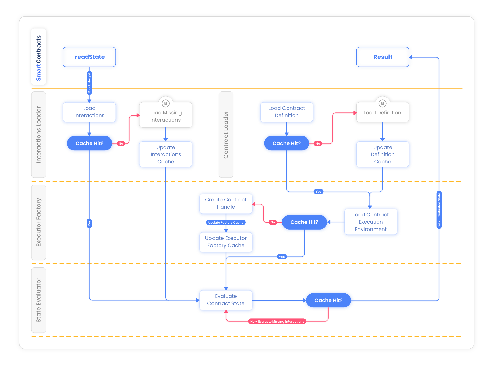

# RedStone SmartContracts SDK
RedStone SmartContracts SDK is the new, written from scratch, implementation of 
the SmartWeave [Protocol](./docs/SMARTWEAVE_PROTOCOL.md).

It works in both web and Node.js environment (requires Node.js 16.5+).

It has been built with performance (e.g. caching at multiple layers, Arweave calls optimization)
and modularity (e.g. ability to use different types of caches, imported from external libraries) in mind.

We're already using the new SDK on production, both in our webapp and nodes.
However, if you'd like to use it in production as well, please contact us on [discord](https://discord.com/invite/PVxBZKFr46) to ensure a smooth transition and get help with testing.

The base motivation behind rewriting the original SDK (and roadmap proposal) has been described [here](./docs/ROAD_MAP.md).  
To further improve contract state evaluation time, one can additionally use AWS CloudFront based Arweave cache described [here](https://github.com/redstone-finance/redstone-smartweave-contracts/blob/main/docs/CACHE.md).

- [Architecture](#architecture)
- [State evaluation diagram](#state-evaluation-diagram)
- [Development](#development)
  - [Installation](#installation)
  - [Import](#import)
  - [Using the RedStone Gateway](#using-the-redstone-gateway)
  - [WASM](#wasm)
  - [VM2](#vm2)
  - [Performance - best practices](#performance---best-practices)
  - [Examples](#examples)
  - [Migration guide](#migration-guide)
  - [Documentation](#documentation)
  - [Missing features](#missing-features)
   
## Architecture
RedStone SmartContracts SDK consists of main 3 layers:


1. The `Core Protocol` layer is the implementation of the original SmartWeave protocol and is responsible for communication with the SmartWeave smart contracts deployed on Arweave. It consists of 5 modules:
   1. `Interactions Loader` - this module is responsible for loading from Arweave all the interaction transactions registered
   for given contract.
   2. `Interactions Sorter` - responsible for sorting the interactions according to the protocol specification. This is crucial operation for the deterministic contract state evaluation.
   3. `Definition Loader` - this module loads all the data related to the given SmartWeave contract - its source code, initial state, etc.
   4. `Executor Factory` - this module is responsible for creating "handles" to the SmartWeave contract. These handles are then used by the SDK to call SmartWeave contract methods.
   5. `State Evaluator` - this module is responsible for evaluating SmartWeave contract state up to the requested block height.
2. The `Caching` layer - is build on top of the `Core Protocol` layer and allows caching results of each of the `Core Protocol` modules separately.
   The main interfaces of this layer are the:
   1. `SwCache` - simple key-value cache, useful for modules like `Definition Loader`
   2. `BlockHeightSwCache` - a block height aware cache, crucial for modules like `Interactions Loader` and `State Evaluator`.
   These interfaces - used in conjunction with cache-aware versions of the core modules (like `CacheableContractInteractionsLoader` or `CacheableStateEvaluator`)
   allow to greatly improve performance and SmartWeave contract's state evaluation time - especially for contracts that heavily interact with other contracts.
3. The `Extensions` layer - includes everything that can be built on top of the core SDK - including Command Line Interface, Debugging tools, different logging implementations,
   so called "dry-runs" (i.e. actions that allow to quickly verify the result of given contract interaction - without writing anything on Arweave).

This modular architecture has several advantages:
1. Each module can be separately tested and developed.
2. The SmartWeave client can be customized depending on user needs (e.g. different type of caches for web and node environment)
3. It makes it easier to add new features on top of the core protocol - without the risk of breaking the functionality of the core layer.

## State evaluation diagram


In order to perform contract state evaluation (at given block height), SDK performs certain operations.
The diagram above and description assume the most basic “mem-cached” SDK client.
1. Users who are interacting with the contract, call the “readState” method.
2. Interactions Loader and Contract Definition Loader modules are then called in parallel - to load all the data required for state evaluation. Both Interactions Loader and Contract Definition Loader first check its corresponding cache whether data is already loaded - and load from Arweave only the missing part.
3. With interactions and contract definition loaded - Executor Factory creates a handle to the SmartWeave contract main function (or loads it from its own cache)
4. With all the interactions and a contract handle - the State Evaluator evaluates the state from the lastly cached value - and returns the result to User.


## Development
PRs are welcome! :-) Also, feel free to submit [issues](https://github.com/redstone-finance/redstone-smartcontracts/issues) - with both bugs and feature proposals.
In case of creating a PR - please use [semantic commit messages](https://gist.github.com/joshbuchea/6f47e86d2510bce28f8e7f42ae84c716).

### Installation
SDK requires node.js version 16.5+.

#### Using npm
`npm install redstone-smartweave`

#### Using yarn
`yarn add redstone-smartweave`

### Import
You can import the full API or individual modules.

```typescript
import * as SmartWeaveSdk from 'redstone-smartweave'
```

```typescript
import { SmartWeave, Contract, ... } from 'redstone-smartweave'
```

The SDK is available in both the ESM and CJS format - to make it possible for web bundlers (like webpack) to effectively
perform tree-shaking.

#### Using web bundles

Bundle files are possible to use in web environment only. Use minified version for production. It is possible to use latest or specified version.

```html
<!-- Latest -->
<script src="https://unpkg.com/redstone-smartweave/bundles/web.bundle.js"></script>

<!-- Latest, minified-->
<script src="https://unpkg.com/redstone-smartweave/bundles/web.bundle.min.js"></script>

<!-- Specific version -->
<script src="https://unpkg.com/redstone-smartweave@0.4.41/bundles/web.bundle.js"></script>

<!-- Specific version, minified -->
<script src="https://unpkg.com/redstone-smartweave@0.4.41/bundles/web.bundle.min.js"></script>

```

All exports are stored under `rsdk` global variable.

```html
<script>
  const smartweave = rsdk.SmartWeaveWebFactory.memCachedBased(arweave);
</script>
```

### Using the RedStone Gateway

#### SDK version >= `0.5.0`
From version `0.5.0`, the RedStone Gateway is the default gateway used by the SDK.
By default, the `{notCorrupted: true}` mode is used (as describe below).  
If you want to use the Arweave gateway in version >= `0.5.0`:
```ts
const smartweave = SmartWeaveNodeFactory.memCachedBased(arweave)
    .useArweaveGateway()
    .build();
```

#### SDK version < `0.5.0`
In order to use the [Redstone Gateway](https://github.com/redstone-finance/redstone-sw-gateway) for loading the contract interactions,
configure the smartweave instance in the following way:
```ts
const smartweave = SmartWeaveNodeFactory.memCachedBased(arweave)
    .useRedStoneGateway()
    .build();
```
The gateway is currently available under [https://gateway.redstone.finance](https://gateway.redstone.finance) url.   
Full API reference is available [here](https://github.com/redstone-finance/redstone-sw-gateway#http-api-reference).

Optionally - you can pass the second argument to the `useRedStoneGateway` method that will determine which transactions will be loaded:
1. no parameter - default mode, compatible with how the Arweave Gateway GQL endpoint works - returns
all the interactions. There is a risk of returning [corrupted transactions](https://github.com/redstone-finance/redstone-sw-gateway#corrupted-transactions).
2. `{confirmed: true}` - returns only confirmed transactions - the most safe mode, eg:
```ts
const smartweave = SmartWeaveNodeFactory.memCachedBased(arweave)
    .useRedStoneGateway( {confirmed: true} )
    .build();
```

3. `{notCorrupted: true}` - returns both confirmed and not yet verified interactions (i.e. the latest ones).
Not as safe as previous mode, but good if you want combine high level of safety with the most recent data.
```ts
const smartweave = SmartWeaveNodeFactory.memCachedBased(arweave)
    .useRedStoneGateway( {notCorrupted: true} )
    .build();
```

More examples can be found [here](https://github.com/redstone-finance/redstone-smartcontracts-examples/blob/main/src/redstone-gateway-example.ts).

### WASM

WASM provides proper sandboxing ensuring execution environment isolation which guarantees security to the contracts execution. As for now - **Assemblyscript**, **Rust** and **Go** languages are supported. WASM contracts templates containing example PST contract implementation within tools for compiling contracts to WASM, testing, deploying (locally, on testnet and mainnet) and writing interactions are available in a [dedicated repository]( https://github.com/redstone-finance/redstone-smartcontracts-wasm-templates). 

Using SDKs' methods works exactly the same as in case of a regular JS contract.

Additionally, it is possible to set gas limit for interaction execution in order to e.g. protect a contract against infinite loops. Defaults to `Number.MAX_SAFE_INTEGER` (2^53 - 1).

```js
contract = smartweave.contract(contractTxId).setEvaluationOptions({
      gasLimit: 14000000
    });
```

### VM2

It is possible to provide an isolated execution environment also in the JavaScript implementation thanks to [VM2](https://github.com/patriksimek/vm2) - a sandbox that can run untrusted code with whitelisted Node's built-in modules. It works only in a NodeJS environment and it enhances security at a (slight) cost of performance, so it should be used it for contracts one cannot trust. 

In order to use VM2, set `useVM2` evaluation option to `true` (defaults to `false`).

```js
contract = smartweave.contract(contractTxId).setEvaluationOptions({
      useVM2: true
    });
```
### Performance - best practices
In order to get the best performance on production environment (or while performing benchmarks ;-)), please follow these simple rules:
1. Do NOT use the `TsLoggerFactory` - it is good for development, as it formats the logs nicely, but might slow down the state evaluation
by a factor of 2 or 3 (depending on the logging level).
2. Use `fatal` or `error` log level, e.g.:
```ts
// configure the logging first
LoggerFactory.INST.logLevel("fatal");
// or
LoggerFactory.INST.logLevel("error");

// then create an instance of smartweave sdk
const smartweave = SmartWeaveWebFactory.memCached(arweave);
```
Logging on `info` or `debug` level is good for development, but turning it on globally might slow down the evaluation by a factor of 2.  
Keep in mind that you can fine tune the log level of each module separately. For example you can switch the `fatal` globally, but `debug`
for the `ArweaveGatewayInteractionsLoader` (in order to verify the load times from Arweave GQL endpoint). The names of the modules are derived from the
names of TypeScript classes, e.g.:
```ts
// configure the logging first
LoggerFactory.INST.logLevel("fatal");
LoggerFactory.INST.logLevel("debug", "ArweaveGatewayInteractionsLoader");

// then create an instance of smartweave sdk
const smartweave = SmartWeaveWebFactory.memCached(arweave);
```

### Examples
Usage examples can be found in
a dedicated [repository](https://github.com/redstone-finance/redstone-smartcontracts-examples).
Please follow instructions in its README.md (and detail-ish comments in the examples files) to learn more.
There is also a separate repository with a web application [example](https://github.com/redstone-finance/redstone-smartcontracts-app).

We've also created a [tutorial](https://github.com/redstone-finance/smartweave-loot/blob/main/docs/LOOT_CONTRACT_TUTORIAL.md) that introduces to the process of writing your own SmartWeave contract from scratch
and describes how to interact with it using RedStone SmartContracts SDK.

### Migration Guide
If you're already using Arweave smartweave.js SDK and would like to smoothly migrate to RedStone SmartContracts SDK -
check out the [migration guide](https://github.com/redstone-finance/redstone-smartweave/blob/main/docs/MIGRATION_GUIDE.md).

### Documentation
TSDocs can be found [here](https://smartweave.docs.redstone.finance/).

### Missing features
Some features from the original Arweave's smartweave.js are not yet implemented. They will be either added soon to the core SDK, or as
a separate libraries, built on top of the SDK:
- CLI (though not sure if that is a necessary - even if, it should be
  probably a separate lib built on top of the base SDK).
