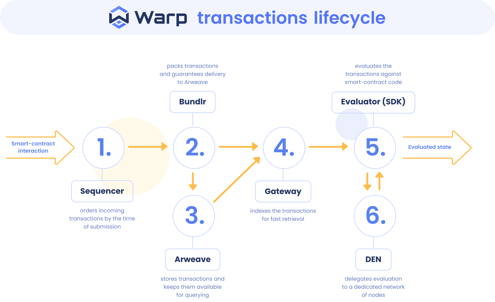

# Warp SDK

> ⚠️ Following library has been renamed from **[redstone-smartweave](https://www.npmjs.com/package/redstone-smartweave)** to **warp-contracts** from version **1.0.0**! If you are using older version please read [README-LEGACY](README-LEGACY.md).

> ⚠️ We're working hard on a new version - `1.2.0-rc.1` - which has many internal improvements/fixes and changes in APIs. The docs for this version are currently avilalbe [here](https://github.com/warp-contracts/warp/tree/ppe/rc#warp-sdk). 

Warp SDK is the implementation of the SmartWeave [Protocol](./docs/SMARTWEAVE_PROTOCOL.md).

It works in both web and Node.js environment (requires Node.js 16.5+).

If you are interested in the main assumptions for Warp ecosystem as well as its key features go visit [our website](https://warp.cc).

- [Development](#development)
  - [Installation](#installation)
    - [Using npm](#using-npm)
    - [Using yarn](#using-yarn)
  - [Import](#import)
  - [WarpFactory](#warpfactory)
    - [forLocal](#forlocal)
    - [forTestnet](#fortestnet)
    - [forMainnet](#formainnet)
    - [custom](#custom)
    - [WarpEnvironment](#warpenvironment)
  - [Deployment](#deployment)
  - [Contract methods](#contract-methods)
    - [`connect`](#connect)
    - [`setEvaluationOptions`](#setevaluationoptions)
    - [`readState`](#readstate)
    - [`viewState`](#viewstate)
    - [`dryWrite`](#drywrite)
    - [`writeInteraction`](#writeinteraction)
    - [`evolve`](#evolve)
  - [WASM](#wasm)
  - [VM2](#vm2)
  - [Internal writes](#internal-writes)
  - [UnsafeClient](#unsafeclient)
  - [Performance - best practices](#performance---best-practices)
  - [Examples](#examples)
  - [Migrations](#migrations)
    - [Old factories to WarpFactory](#old-factories-to-warpfactory)
    - [Sqlite to LevelDB](#sqlite-to-leveldb)
- [Examples](#examples)
- [Warp transaction lifecycle](#warp-transaction-lifecycle)

## Development

PRs are welcome! :-) Also, feel free to submit [issues](https://github.com/redstone-finance/warp/issues) - with both bugs and feature proposals.
In case of creating a PR - please use [semantic commit messages](https://gist.github.com/joshbuchea/6f47e86d2510bce28f8e7f42ae84c716).

### Installation

SDK requires node.js version 16.5+.

#### Using npm

`npm install warp-contracts`

#### Using yarn

`yarn add warp-contracts`

### Import

You can import the full API or individual modules.

The SDK is available in both the ESM and CJS format - to make it possible for web bundlers (like webpack) to effectively
perform tree-shaking.

**ESM**

```typescript
import * as WarpSdk from 'warp-contracts';
```

```typescript
import { Warp, Contract, ... } from 'warp-contracts'
```

**CJS**

```javascript
const Warp = require('warp-contracts');
```

```javascript
const { Warp, Contract, ... } = require('warp-contracts');
```

#### Using web bundles

Bundle files are possible to use in web environment only. Use minified version for production. It is possible to use latest or specified version.

```html
<!-- Latest -->
<script src="https://unpkg.com/warp-contracts/bundles/web.bundle.js"></script>

<!-- Latest, minified-->
<script src="https://unpkg.com/warp-contracts/bundles/web.bundle.min.js"></script>

<!-- Specific version -->
<script src="https://unpkg.com/warp-contracts@1.0.0/bundles/web.bundle.js"></script>

<!-- Specific version, minified -->
<script src="https://unpkg.com/warp-contracts@1.0.0/bundles/web.bundle.min.js"></script>
```

All exports are stored under `warp` global variable.

```html
<script>
  const warp = warp.WarpFactory.warpGw(arweave);
</script>
```

### WarpFactory

To properly initialize Warp you can use one of three methods available in WarpFactory class which simplifies the process of creating Warp.

#### forLocal

Creates a Warp instance suitable for testing in a local environment (e.g. with a use of a ArLocal instance).

```typescript
warp = WarpFactory.forLocal();
```

Default parameters (each of them can be adjusted to your needs):

1. `port` - set to `1984`
2. `arweave` - Arweave initialized with `host` set to `localhost`, `port` set to default `port` from p. 1 and `protocol` set to `http`
3. `cacheOptions` - optional cache options parameter, by default `inMemory` cache is set to `true`

#### forTestnet

Creates a Warp instance suitable for testing with Warp testnet (https://testnet.redstone.tools/).

```typescript
warp = WarpFactory.forTestnet();
```

Default parameters (each of them can be adjusted to your needs):

1. `arweave` - Arweave initialized with `host` set to `testnet.redstone.tools`, `port` set to `443` and `protocol` set to `https`
2. `cacheOptions` - optional cache options parameter, by default `inMemory` cache is set to `false`

#### forMainnet

Creates a Warp instance suitable for use with mainnet.
By default, the Warp gateway (https://github.com/warp-contracts/gateway#warp-gateway) is being used for:

1.  deploying contracts
2.  writing new transactions through Warp Sequencer
3.  loading contract interactions

```typescript
warp = WarpFactory.forMainnet();
```

Default parameters (each of them can be adjusted to your needs):

1. `cacheOptions` - optional cache options parameter, by default `inMemory` cache is set to `false`
2. `useArweaveGw` - defaults to `false`, if set to `true` - `arweave.net` gateway is used for deploying contracts, writing and loading interactions
3. `arweave` - Arweave initialized with `host` set to `arweave.net`, `port` set to `443` and `protocol` set to `https`

#### custom

Allows to fully customize `Warp` instance.

```typescript
warp = WarpFactory.custom(
  arweave,
  {
    ...defaultCacheOptions,
    inMemory: true
  },
  'testnet'
)
  .useArweaveGateway()
  .setInteractionsLoader(loader)
  .build();
```

No default parameters are provided, these are the parameters that you can adjust to your needs:

1. `arweave` - initializes Arweave
2. `cacheOptions` - optional cache options parameter
3. `environment` - environment in which Warp will be initialized

`custom` method returns preconfigured instance of `Warp` - `WarpBuilder` which can be customized, the configuration is finished with `build` method.

#### WarpEnvironment

`WarpEnvironment` is a helper type which can be used in scripts etc. to determine in which environment Warp has been initialized.

Possible options:

```typescript
'local' | 'testnet' | 'mainnet' | 'custom';
```

```typescript
  if (warp.environment == 'mainnet') {
    ...
  }
```

### Deployment

#### deploy

Deploys contract to Arweave. By default, deployment transaction is bundled and posted on Arweave using Warp Sequencer. If you want to deploy your contract directly to Arweave - disable bundling by setting `disableBundling` to `true`.

```typescript
async function deploy(contractData: ContractData, disableBundling?: boolean): Promise<ContractDeploy>;
```

<details>
  <summary>Example</summary>

```typescript
const { contractTxId, srcTxId } = await warp.createContract.deploy({
  wallet,
  initState: initialState,
  data: { 'Content-Type': 'text/html', body: '<h1>HELLO WORLD</h1>' },
  src: contractSrc,
  tags
});
```

</details>

#### deployFromSourceTx

Deploys contract from source transaction. By default deployment transaction is bundled and posted on Arweave using Warp Sequencer. If you want to deploy your contract directly to Arweave - disable bundling by setting `disableBundling` to `true`.

```typescript
async function deployFromSourceTx(
  contractData: FromSrcTxContractData,
  disableBundling?: boolean
): Promise<ContractDeploy>;
```

<details>
  <summary>Example</summary>

```typescript
const { contractTxId, srcTxId } = await warp.createContract.deployFromSourceTx({
  wallet,
  initState: initialState,
  srcTxId: 'SRC_TX_ID'
});
```

</details>

### Contract methods

#### `connect`

```typescript
connect(signer: ArWallet | SigningFunction): Contract<State>;
```

Allows to connect wallet to a contract. Connecting a wallet MAY be done before "viewState" (depending on contract implementation, ie. whether called contract's function required "caller" info) Connecting a wallet MUST be done before "writeInteraction".

- `signer` - JWK object with private key, 'use_wallet' string or custom signing function.

<details>
  <summary>Example</summary>

```typescript
const contract = warp.contract('YOUR_CONTRACT_TX_ID').connect(jwk);
```

</details>

---

#### `setEvaluationOptions`

```typescript
function setEvaluationOptions(options: Partial<EvaluationOptions>): Contract<State>;
```

Allows to set [EvaluationOptions](https://github.com/warp-contracts/warp/blob/main/src/core/modules/StateEvaluator.ts#L123) that will overwrite current configuration.

<details>
  <summary>Example</summary>

```typescript
const contract = warp.contract('YOUR_CONTRACT_TX_ID').setEvaluationOptions({
  waitForConfirmation: true,
  ignoreExceptions: false
});
```

</details>

---

#### `readState`

```typescript
import {SortKeyCacheResult} from "./SortKeyCache";

async function readState(
        sortKeyOrBlockHeight?: string | number,
        currentTx?: { contractTxId: string; interactionTxId: string }[]
): Promise<SortKeyCacheResult<EvalStateResult<State>>>;
```

Returns state of the contract at required blockHeight or sortKey. Similar to the `readContract` from the version 1.

- `sortKeyOrBlockHeight` - either a sortKey or block height at which the contract should be read
- `currentTx` - if specified, will be used as a current transaction

<details>
  <summary>Example</summary>

```typescript
const { sortKey, cachedValue } = await contract.readState();
```

</details>

---

#### `viewState`

```typescript
async function viewState<Input, View>(
  input: Input,
  blockHeight?: number,
  tags?: Tags,
  transfer?: ArTransfer
): Promise<InteractionResult<State, View>>;
```

Returns the "view" of the state, computed by the SWC - ie. object that is a derivative of a current state and some specific smart contract business logic. Similar to the `interactRead` from the current SDK version.

- `input` the interaction input
- `blockHeight` if specified the contract will be replayed only to this block height
- `tags` an array of tags with name/value as objects
- `transfer` target and winstonQty for transfer

<details>
  <summary>Example</summary>

```typescript
const { result } = await contract.viewState<any, any>({
  function: "NAME_OF_YOUR_FUNCTION",
  data: { ... }
});
```

</details>

---

#### `dryWrite`

```typescript
async function dryWrite<Input>(
  input: Input,
  caller?: string,
  tags?: Tags,
  transfer?: ArTransfer
): Promise<InteractionResult<State, unknown>>;
```

A dry-write operation on contract. It first loads the contract's state and then creates a "dummy" transaction and applies the given Input on top of the current contract's state.

- `input` - input to be applied on the current contract's state
- `tags` - additional tags to be added to interaction transaction
- `transfer` - additional transfer data to be associated with the "dummy" transaction
- `caller` - an option to override the caller - if available, this value will overwrite the caller evaluated from the wallet connected to this contract.

<details>
  <summary>Example</summary>

```typescript
const result = await contract.dryWrite({
  function: "NAME_OF_YOUR_FUNCTION",
  data: { ... }
});
```

</details>

---

#### `writeInteraction`

```typescript
async function writeInteraction<Input = unknown>(
  input: Input,
  options?: WriteInteractionOptions
): Promise<WriteInteractionResponse | null>;
```

Writes a new "interaction" transaction - ie. such transaction that stores input for the contract.

- `input` the interaction input
- `options` - an object with some custom options (see [WriteInteractionOptions](https://github.com/warp-contracts/warp/blob/src/contract/Contract.ts#L46))

By default write interaction transactions are bundled and posted on Arweave using Warp Sequencer. If you want to post transactions directly to Arweave - disable bundling by setting `options.disableBundling` to `true`.

<details>
  <summary>Example</summary>

```typescript
const result = await contract.writeInteraction({
  function: "NAME_OF_YOUR_FUNCTION",
  data: { ... }
});
```

</details>

---

#### `evolve`

```typescript
async function evolve(newSrcTxId: string, options?: WriteInteractionOptions): Promise<WriteInteractionResponse | null>;
```

Allows to change contract's source code, without having to deploy a new contract. This method effectively evolves the contract to the source. This requires the `save` method to be called first and its transaction to be confirmed by the network.

- `newSrcTxId` - result of the `save` method call.
- `options` - an object with some custom options (see [WriteInteractionOptions](https://github.com/warp-contracts/warp/blob/src/contract/Contract.ts#L46))

By default evolve interaction transactions are bundled and posted on Arweave using Warp Sequencer. If you want to post transactions directly to Arweave - disable bundling by setting `options.disableBundling` to `true`.

<details>
  <summary>Example</summary>

```typescript
const result = await contract.evolve('srcTxId');
```

</details>

#### save

Allows to save contract source on Arweave. Currently, using bundler to save the source is not possible.

```typescript
async function save(
  contractSource: SourceData,
  signer?: ArWallet | SigningFunction,
  useBundler?: boolean
): Promise<string | null>;
```

<details>
  <summary>Example</summary>

```typescript
const newSrcTxId = await contract.save({ src: newSource });
```

</details>

### WASM

WASM provides proper sandboxing ensuring execution environment isolation which guarantees security to the contracts execution. As for now - **Assemblyscript**, **Rust** and **Go** languages are supported. WASM contracts templates containing example PST contract implementation within tools for compiling contracts to WASM, testing, deploying (locally, on testnet and mainnet) and writing interactions are available in a [dedicated repository](https://github.com/redstone-finance/redstone-smartcontracts-wasm-templates).

Using SDKs' methods works exactly the same as in case of a regular JS contract.

Additionally, it is possible to set gas limit for interaction execution in order to e.g. protect a contract against infinite loops. Defaults to `Number.MAX_SAFE_INTEGER` (2^53 - 1).

```js
contract = smartweave.contract(contractTxId).setEvaluationOptions({
  gasLimit: 14000000
});
```

### VM2

It is possible to provide an isolated execution environment also in the JavaScript implementation thanks to [VM2](https://github.com/patriksimek/vm2) - a sandbox that can run untrusted code with whitelisted Node's built-in modules. It works only in a NodeJS environment and it enhances security at a (slight) cost of performance, so it should be used it for contracts one cannot trust.

In order to use VM2, set `useVM2` evaluation option to `true` (defaults to `false`).

```js
contract = warp.contract(contractTxId).setEvaluationOptions({
  useVM2: true
});
```

### Internal writes

SmartWeave protocol currently natively does not support writes between contract - contracts can only read each others' state. This lack of interoperability is a big limitation for real-life applications - especially if you want to implement features like staking/vesting, disputes - or even a standard approve/transferFrom flow from ERC-20 tokens.

SmartWeave protocol has been extended in Warp by adding internal writes feature.

A new method has been added to SmartWeave global object. It allows to perform writes on other contracts.

1. The method first evaluates the target (ie. specified by the contractTxId given in the first parameter) contract's state up to the "current" block height (ie. block height of the interaction that is calling the write method) and then applies the input (specified as the secon parameter of the write method). The result is memoized in cache.

```
await SmartWeave.contracts.write(contractTxId, { function: 'add' });
```

2. For each newly created interaction with given contract - a dry run is performed and the call report of the dry-run is analysed. A list of all inner-calls between contracts is generated. For each generated inner call - an additional tag is generated: {'interactWrite': contractTxId}- where contractTxId is the callee contract.

3. When state is evaluated for the given contract ("Contract A") all the interactions - `direct` and `internalWrites`. If it is an `internalWrite` interaction - contract specified in the `internalWrite` ("Contract B") tag is loaded and its state is evaluate. This will cause the `write` method (described in p.1) to be called. After evaluating the "Contract B" contract state - the latest state of the "Contract A" is loaded from cache (it has been updated by the write method) and evaluation moves to next interaction.

In order for internal calls to work you need to set `evaluationOptions` to `true`:

```ts
const callingContract = smartweave
  .contract<ExampleContractState>(calleeTxId)
  .setEvaluationOptions({
    internalWrites: true
  })
  .connect(wallet);
```

You can also perform internal read to the contract (originally introduced by the protocol):

```
await SmartWeave.contracts.readContractState(action.input.contractId);
```

You can view some more examples in the [internal writes test directory](https://github.com/redstone-finance/redstone-smartcontracts/tree/main/src/__tests__/integration/internal-writes). If you would like to read whole specification and motivation which stands behind introducing internal writes feature, please read [following issue](https://github.com/redstone-finance/redstone-smartcontracts/issues/37).

### unsafeClient

`unsafeClient` is available to use on `Smartweave` global object. It gives access to whole `Arweave` instance.
Example of usage:

```typescript
const result = await SmartWeave.unsafeClient.transactions.getData('some_id);
```

However, we do not recommend using it as it can lead to non-deterministic results. Therefore, we do not support it by default in Warp. If you want to use it anyway, you need to explicitely set `EvaluationOptions.allowUnsafeClient` flag to `true`.

### Cache

Warp uses [LevelDB](https://github.com/google/leveldb) to cache the state. During the state evaluation, state is then evaluated only for the interactions that the state hasn't been evaluated yet. State is being cached per transaction and not per block height.
The reason behind that caching per block height is not enough if multiple interactions are at the same height and two contracts interact with each other.
The LevelDB is a lexicographically sorted key-value database - so it's ideal for this use case - as it simplifies cache look-ups (e.g. lastly stored value or value "lower-or-equal" than given sortKey). The cache for contracts are implemented as [sub-levels](https://www.npmjs.com/package/level#sublevel--dbsublevelname-options).
The default location for the node.js cache is `./cache/warp`.

In the browser environment Warp uses [IndexedDB](https://developer.mozilla.org/en-US/docs/Web/API/IndexedDB_API) to cache the state - it's a low-level API for client-side storage.
The default name for the browser IndexedDB cache is warp-cache.

In order to reduce the cache size, the oldest entries are automatically pruned.

It is possible to use the in-memory cache instead by setting `cacheOptions.inMemory` to `true` while initializing Warp. `inMemory` cache is used by default in local environment.

### Migrations

#### old factories to WarpFactory

1. Mainnet
   This is how you would intiialize Warp 'the old way':

```typescript
const warp = WarpNodeFactory.memCachedBased(arweave).build();
```

or - for browser:

```typescript
const warp = WarpNodeFactory.memCachedBased(arweave).build();
```

Now, you just need to initialize it like so:

```typescript
const warp = WarpFactory.forMainnet();
```

If you want to use `Arweave` gateway instead of default `Warp` gateway, go with a custom configuration:

```typescript
const warp = WarpFactory.custom(
  arweave,
  {
    ...defaultCacheOptions
  },
  'mainnet'
)
  .useArweaveGateway()
  .build();
```

2. RedStone public testnet

Previously, you would intialize Warp in testnet environment exactly like you would initialize Warp in mainnet, you would just need to set correct Arweave instance. Now the process is simplified:

```typescript
warp = WarpFactory.forTestnet();
```

3. ArLocal

This is how you would intialize it previously:

```typescript
warp = WarpNodeFactory.forTesting(arweave);
```

Now:

```typescript
warp = WarpFactory.forLocal();
```

Remember that you are always allowed to initialize Warp depending on your needs by using `custom` factory method.

#### sqlite to levelDB

If you've been using Knex based cache you can now easily migrate your sqlite database to levelDB. Just use our [migration tool](./tools/migrate.ts), set correct path to your sqlite database in this line:

```typescript
const result = await warp.migrationTool.migrateSqlite('./tools/sqlite/contracts-3008.sqlite');
```

...and run the script:

```powershell
yarn ts-node -r tsconfig-paths/register tools/migrate.ts
```

### Examples

Usage examples can be found in
a dedicated [repository](https://github.com/redstone-finance/redstone-smartweave-examples).
Please follow instructions in its README.md (and detail-ish comments in the examples files) to learn more.
There is also a separate repository with a web application [example](https://github.com/redstone-finance/redstone-smartcontracts-app).

We've also created an [academy](https://redstone.academy/) that introduces to the process of writing your own SmartWeave contract from scratch and describes how to interact with it using Warp SDK.

A community package - [arweave-jest-fuzzing](https://github.com/Hansa-Network/arweave-jest-fuzzing/blob/master/README.md) has been released thanks to Hansa Network to help SmartWeave developers write fuzzy tests.

## Warp transaction lifecycle



Warp SDK is just part of the whole Warp smart contracts platform. It makes transactions processing and evaluation easy and effective.

1. Our Sequencer assigns order to SmartWeave interactions, taking into account sequencer’s timestamp, current Arweave network block height and is salted with sequencer’s key.

2. Interactions are then packed by Bundlr which guarantees transactions finality and data upload reliability.
   The ability to directly process rich content

3. Transactions are stored on Arweave where they are available for querying.

4. The key component for the lazy-evaluation nature of SmartWeave protocol is fast and reliable interaction loading. Thanks to our gateway we guarantee loading transactions in seconds in a reliable way - it has built-in protection against forks and corrupted transactions. Our gateway enables fast queries and efficient filtering of interactions, which in effect greatly reduces state evaluation time.

5. Lastly, transactions can be evaluated either by our SDK or the evaluation can be delegated to a distribution execution network - a dedicated network of nodes (DEN). Multi-node executors network listens to incoming transactions and automatically update contract state.
