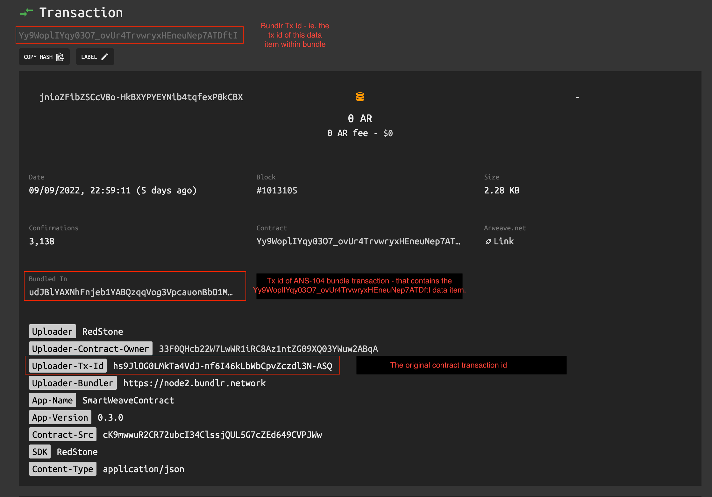

# Warp Bundled Contract Format

This document describes the core concepts behind the Warp bundled contract format.

## Introduction

The idea behind Warp Bundled Contract Format is to increase the Developer and User Experience.  
Normally, when a contract is being deployed on Arweave, one have to wait some time:

1. for the contract's transactions mining (~2 minutes)
2. for the proper contract's transactions confirmation (assuming at least 10 blocks - ~20 minutes)

This in total gives ~20-25 minutes, which:

1. Breaks the DX, e.g. in case developer wants to quickly test the new contract version on Arweave mainnet
2. Breaks the UX, e.g. if given protocol deploys the contracts dynamically - e.g. via GUI (e.g. deploying
   NFT collections, connecting deployed data with access rights, etc.)

Additionally, deploying contracts requires some amount of ARs in the wallet - which might further increase
the entry barrier, both for developers and given protocol users.

## Advantages of using Warp Gateway for contracts deployment
1. Contract is instantly available - as soon as proper response from Bundlr network is received.
2. Contract deployment does not require any ARs in the wallet - the deployment via Bundlr network is either
fully subsidized by the Arweave (for transactions <= 100KiB) or by the Warp (for transactions > 100KiB).
The max transaction size is currently 2MiB.
3. Even though the Bundlr transactions are created and signed by the Warp's wallet, it is still possible to identify
the original transaction owner/signer.

## How it works

Instead of posting the contract and contract source transactions directly to Arweave mainnet, both are sent to Warp
Gateway (`/gateway/contracts/deploy` endpoint) (this is the default behaviour of Warp's SDK `warp.createContract.deploy` function, when `forMainnet` instance is being used).

The Warp Gateway then:

1. Posts contract transactions (i.e. the base contract transaction and contract source transaction - or only the
   contract transaction, if deploying from existing source) to the Bundlr network. Each contract transaction is sent as
   a separate Bundlr transaction - as the `data` of the bundled transaction. The Bundlr transaction in this case might
   be considered as a "carrier" of the original transaction. Additionally - some additional tags to the Bundlr transaction
   are added.

```ts
const bTx = bundlr.createTransaction(JSON.stringify(transaction), {tags});
await bTx.sign();
const bundlrResponse = await bTx.upload();
```

Transaction which is sent to Bundlr, consists of:

| Transaction field                           | Value                                                 |
|---------------------------------------------|-------------------------------------------------------|
| `data`                                      | The original transaction, JSON stringified            |
| `tag['Uploader']`                           | `RedStone`                                            |
| `tag['Uploader-Contract-Owner']`            | The original owner/signar of the contract transaction |
| `tag['Uploader-Tx-Id']`                     | The id of the original transaction                    |
| ...all the tags of the original transaction |                |

**NOTE** The original transaction is not modified in any way - this is to preserve the original
signature!

2. After receiving proper response and receipt from Bundlr, the Warp gateway indexes the contract
   transactions data internally - to make them instantly available.

3. Finally, the Warp gateway returns an object as a `response` - that consists of fields:
- `response.contractId` - the original contract tx id
- `response.bundleContractId` - the Bundlr contract tx id
- `response.srcTxId` - the original contract source transaction id
- `response.bundleSrcId` - the Bundlr source tx id.

## Resulting transaction structure

This is how the example contract transaction `hs9JlOG0LMkTa4VdJ-nf6I46kLbWbCpvZczdl3N-ASQ` looks like on [ViewBlock](https://viewblock.io/arweave/tx/Yy9WoplIYqy03O7_ovUr4TrvwryxHEneuNep7ATDftI).  

**NOTE** Keep in mind that it takes some time before Bundlr posts given bundle to Arweave and ViewBlock actually index such bundle and its contents - usually it may take 1-2 days.


1. The `Yy9WoplIYqy03O7_ovUr4TrvwryxHEneuNep7ATDftI` is the id of the bundled item - assigned by Bundlr during data item creation - according to ANS-104 [specs](https://github.com/ArweaveTeam/arweave-standards/blob/master/ans/ANS-104.md#2-dataitem-signature-and-id).
2. The `udJBlYAXNhFnjeb1YABQzqqVog3VpcauonBbO1MSwvc` is the id of the Arweave bundle transaction - that contains a data item from point 1, stored in `data` field - according to ANS-104 [specs](https://github.com/ArweaveTeam/arweave-standards/blob/master/ans/ANS-104.md#12-transaction-body-format)  
**NOTE** This is the only "real" Arweave transaction
3. The `hs9JlOG0LMkTa4VdJ-nf6I46kLbWbCpvZczdl3N-ASQ` is the original transaction id - as it was created and signed by the original protocol user.
The transaction with this id is effectively a content of the bundle item (point 1.) - i.e. is stored in `dataItem.data` [field](https://github.com/ArweaveTeam/arweave-standards/blob/master/ans/ANS-104.md#13-dataitem-format)

**NOTE** Only the last transaction (from point 3.) is effectively important from the SmartWeave protocol perspective - it is the transaction that the protocol 'sees' when it loads the contract.


## Contract transaction retrieval via Arweave gateway

1. Directly via `response.bundleContractId` - e.g. https://arweave.net/Yy9WoplIYqy03O7_ovUr4TrvwryxHEneuNep7ATDftI  
   **NOTE 1** The response object contains the full, original tx - including its data and id (`hs9JlOG0LMkTa4VdJ-nf6I46kLbWbCpvZczdl3N-ASQ` in this case).  
   **NOTE 2** The `data` field contains the original contract's data. Usually it is an initial contract state or an asset - for AtomicNFT contracts.  
   **NOTE 3** The `Yy9WoplIYqy03O7_ovUr4TrvwryxHEneuNep7ATDftI` is the Bundlr's tx id - assigned by
   the `bundlr.createTransaction()`.
   It is part of `ANS-104` bundle, that is uploaded to Arweave by Bundlr network - with the original tx as a `data-item`.

2. Using the GQL endpoint, using the original contract tx id (`hs9JlOG0LMkTa4VdJ-nf6I46kLbWbCpvZczdl3N-ASQ` in this case) and `Uploader-Tx-Id` tag, e.g.

```qql
query {
  transactions(
    tags: [{
      name: "Uploader-Tx-Id",
      values: ["hs9JlOG0LMkTa4VdJ-nf6I46kLbWbCpvZczdl3N-ASQ"]
    }]
  ) {
    edges {
      node {
          id
          tags {
            name
            value
          }
          block {
            height
          }
        }
    }
  }
}
```

Example Response:

```json
{
  "transactions": {
    "edges": [
      {
        "node": {
          "id": "Yy9WoplIYqy03O7_ovUr4TrvwryxHEneuNep7ATDftI",
          "tags": [
            {
              "name": "Uploader",
              "value": "RedStone"
            },
            {
              "name": "Uploader-Contract-Owner",
              "value": "33F0QHcb22W7LwWR1iRC8Az1ntZG09XQ03YWuw2ABqA"
            },
            {
              "name": "Uploader-Tx-Id",
              "value": "hs9JlOG0LMkTa4VdJ-nf6I46kLbWbCpvZczdl3N-ASQ"
            },
            {
              "name": "Uploader-Bundler",
              "value": "https://node2.bundlr.network"
            },
            {
              "name": "App-Name",
              "value": "SmartWeaveContract"
            },
            {
              "name": "App-Version",
              "value": "0.3.0"
            },
            {
              "name": "Contract-Src",
              "value": "cK9mwwuR2CR72ubcI34ClssjQUL5G7cZEd649CVPJWw"
            },
            {
              "name": "SDK",
              "value": "RedStone"
            },
            {
              "name": "Content-Type",
              "value": "application/json"
            }
          ],
          "block": {
            "height": 1013105
          }
        }
      }
    ]
  }
}
```

**NOTE** The `transactions.edges.node.id` is an id of the Bundlr transaction - the 'carrier' of the original transaction.

## Contract transaction retrieval via Warp gateway
The Warp `/gateway/contract` endpoint allows to retrieve the Bundle contracts data directly via the original tx id.
This endpoint is used by default for loading contracts data by the Warp SDK - when `forMainnet` instance is being used.


## Contract transaction data retrieval
1. Using the Warp gateway - `gateway/contract-data/:original-tx-id`.
E.g.: https://gateway.redstone.finance/gateway/contract-data/hs9JlOG0LMkTa4VdJ-nf6I46kLbWbCpvZczdl3N-ASQ.  
This endpoint underneath maps the original tx id to the Bundlr tx id.
Having the original Bundlr tx id - it loads the original tx data either from arweave.net cache - or fallbacks to the Bundlr node.
The data is then decoded using a dedicated function - https://github.com/warp-contracts/gateway/blob/main/src/gateway/router/routes/contractDataRoute.ts#L57
2. Using Arweave gateway -
   1. get the Bundlr tx id - as shown in the GQL example
   2. load the tx data using the `arweave.net/{txId}` endpoint
   3. decode the response `data` field using the https://github.com/warp-contracts/gateway/blob/main/src/gateway/router/routes/contractDataRoute.ts#L57
   algorithm.
