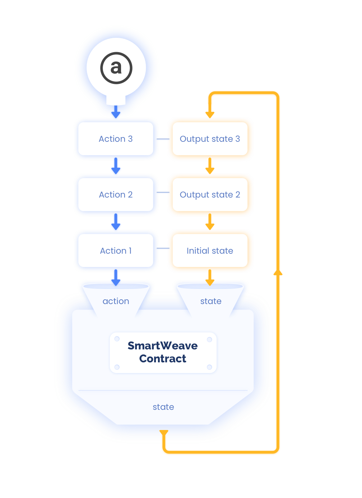

# SmartWeave Protocol

This document describes the core concepts behind the SmartWeave smart contracts protocol and is based
on the original smartweave.js [contract-guide](https://github.com/ArweaveTeam/SmartWeave/blob/master/CONTRACT-GUIDE.md).

## Introduction

SmartWeave is a data-centered protocol built on top of the Arweave chain that allows to implement smart contracts.
The key difference between SmartWeave and other similar solutions is that the contracts can be evaluated
on-demand and "lazily".

Most smart contracts treat data as a side-product that slows down processing.
Data is digested, pruned, and pushed out to side chains.
Nonetheless, the bloated global state is still the biggest challenge of modern blockchains - as it leads
to extreme costs of data storage.

SmartWeave approach, on the other hand, has several advantages:

1. It decouples the storage from the computation
2. It allows for a flexible lazy-evaluation pattern
3. It allows to directly process rich content.

Building SmartWeave on the Arweave allows saving time on the
development of the basic infrastructure.

## Protocol Specification

The SmartWeave protocol consists of few key concepts:

1. [Contract creation](#contract-creation)
2. [Contract interactions](#contract-interactions)
3. [Lazy-evaluation of the contract state](#lazy-evaluation-of-the-contract-state)

### Contract creation

In order to deploy a new contract on Arweave the SmartWeave client must:

1. Create an Arweave transaction with contract source code

| Transaction field     | Value                                                                     |
| --------------------- | ------------------------------------------------------------------------- |
| `data`                | [Contract Source Code specification](#contract-source-code-specification) |
| `tag['App-Name']`     | `SmartWeaveContractSource`                                                |
| `tag['App-Version']`  | the current version of the SDK, e.g. version from package.json            |
| `tag['Content-Type']` | `application/javascript`                                                  |

2. Create an Arweave transaction with contract definition

| Transaction field          | Value                                                                                             |
| -------------------------- | ------------------------------------------------------------------------------------------------- |
| `data`(\*)                 | Contract initial state - stringified json object - e.g. `JSON.stringify(initialState)`            |
| `tag['Init-State']`(\*)    | Contract initial state - as alternative for setting it in data field                              |
| `tag['Init-State-TX']`(\*) | Id of the transaction the holds the initial state                                                 |
| `tag['App-Name']`          | `SmartWeaveContract`                                                                              |
| `tag['App-Version']`       | the current version of the SDK, e.g. version from package.json                                    |
| `tag['Content-Type']`      | `application/javascript`                                                                          |
| `tag['Contract-Src']`      | id of the transaction created in previous step, eg: `ovqOT6dVD7zYZYmIkq52gmSippk2MGs_TjXs3-D4BLU` |

(\*) Either one of these options must be chosen for storing the initial state.

#### Contract source code specification

1. A contract source code MAY be written in ES module format.
2. A contract source MUST contain function (sync or async) named `handle`.
3. A contract source MAY use IIFE bundling format.
4. The `handle` function MUST accept exactly two arguments: `state` and `action`
5. The `state` argument MUST be the current state of the contract.
6. The `action` argument MUST contain `caller` field (i.e. Arweave wallet address)
   and `input` field. The `input` field MUST contain the `function` field and any
   additional data required to perform given operation.
7. The maximum size of the JSON.stringified representation of the `input` field MUST NOT exceed 2048 bytes.
8. The `handle` function MUST terminate by either:
   1. returning `{ state: newState }` - this will cause the contract state to be updated
   2. returning `{ result: newResult }`
   3. throwing `ContractError`

### Contract Interactions

Contract interactions allow to modify the contract state. Each interaction MUST be deployed
as a separate Arweave transaction:

| Transaction field    | Value                                                          |
| -------------------- | -------------------------------------------------------------- |
| `tag['App-Name']`    | `SmartWeaveAction`                                             |
| `tag['App-Version']` | the current version of the SDK, e.g. version from package.json |
| `tag['Contract']`    | Transaction id of the contract                                 |
| `tag['Input']`       | JSON.stringified representation of the input                   |

### Lazy-evaluation of the contract state

In its current form, the SmartWeave protocol assumes that smart contract code is a javascript function,
defined as:

```javascript
contractFunction = (state, action) => state;
```

This function takes a state and an action as input arguments - and produces a new state as a result.
In functional programming terms it acts as a `fold` function - the state of the contract is derived from:
1. An initial state
2. A contract function
3. An ordered list of actions



In order to evaluate contract state, SmartWeave Protocol client:
1. Loads all the contract's interaction transactions up to the requested block height.
2. Sorts the interaction transactions. The order of the interactions is determined firstly by interaction 
transaction block height (i.e. when the transaction was mined in the chain) and secondly by `sha256(transactionId + blockHash)`.
The full ordering is `[ block_height, sha256(transactionId + blockHash) ]`.
3. Applies the sorted interactions onto the contract's `handler` function - evaluating contract's state
   up to the requested block height.
